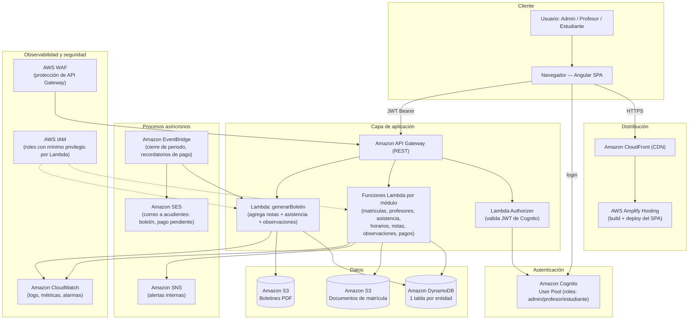
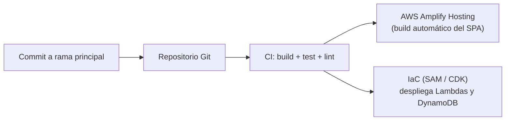

# Arquitectura en AWS — Sistema Escolar

## 1. Enfoque de gestión tecnológica

Este proyecto no se limita a construir el software: aplica gestión tecnológica al elegir, justificar y planear la infraestructura sobre la que ese software va a operar durante su ciclo de vida. Las decisiones se tomaron con tres criterios propios de la gestión tecnológica institucional:

1. **Vigilancia e identificación tecnológica** — se evaluaron servicios *serverless* de AWS frente a un servidor tradicional (EC2 + base de datos administrada por el colegio), priorizando bajo costo de operación, cero mantenimiento de infraestructura y escalado automático (crítico en instituciones educativas: la carga es estacional — matrículas, cierre de periodo, generación de boletines).
2. **Apropiación y transferencia** — la aplicación se construyó primero en modo *mock* (datos locales) para que el equipo funcional (rectoría, coordinación, docentes) pueda validar el producto sin depender de que la infraestructura de AWS ya esté aprovisionada, reduciendo el riesgo del proyecto.
3. **Escalamiento controlado** — el cambio de mock a nube real es un *feature flag* (`environment.useMockData`), no una reescritura. Esto permite una migración gradual: primero autenticación (Cognito), luego un módulo piloto (p. ej. Asistencia), y finalmente el resto.

## 2. Diagrama de arquitectura objetivo

## 3. Mapeo módulo → servicio AWS

| Módulo del sistema | Servicio principal | Detalle |
|---|---|---|
| Autenticación y roles | **Amazon Cognito** | User Pool con grupos `admin`, `profesor`, `estudiante`; el JWT emitido incluye el rol como *custom claim* usado por el Lambda Authorizer. |
| Matrículas | Lambda + DynamoDB + **S3** | Datos del estudiante en DynamoDB; documentos de matrícula (cédula, foto, certificados) en S3 con URL prefirmada. |
| Profesores | Lambda + DynamoDB | CRUD estándar. |
| Horarios | Lambda + DynamoDB | Bloques por curso/día; consulta filtrada por `cursoId` (GSI). |
| Asistencia | Lambda + DynamoDB | Escritura por lote (un curso x fecha); GSI por `estudianteId` para el histórico individual. |
| Notas | Lambda + DynamoDB | GSI por `estudianteId + periodo` para cálculo rápido de promedios. |
| Observaciones | Lambda + DynamoDB | Igual patrón que Notas. |
| Boletines | **Lambda dedicada + S3 + EventBridge** | Se calcula bajo demanda o de forma programada al cierre de periodo; el PDF resultante se guarda en S3 y se notifica al acudiente por **SES**. |
| Pagos | Lambda + DynamoDB (+ pasarela de pago externa, ej. PSE/Wompi) | El estado `Vencido` se recalcula con una regla programada de EventBridge; en producción, la confirmación de pago llegaría por webhook a API Gateway. |
| Hosting del frontend | **AWS Amplify Hosting + CloudFront** | Build y despliegue continuo del Angular SPA con distribución global y HTTPS. |
| Observabilidad | **CloudWatch + WAF** | Logs centralizados de cada Lambda, alarmas de error/latencia, protección contra abuso de la API. |

## 4. Modelo de datos (DynamoDB)

Cada entidad del dominio (`src/app/core/models/models.ts`) corresponde 1:1 a una tabla DynamoDB con `id` como *partition key*:

- `Estudiantes` (PK `id`, GSI `cursoId`)
- `Profesores` (PK `id`)
- `Cursos` (PK `id`)
- `Horarios` (PK `id`, GSI `cursoId`)
- `Asistencia` (PK `id`, GSI `cursoId-fecha`, GSI `estudianteId`)
- `Notas` (PK `id`, GSI `estudianteId-periodo`)
- `Observaciones` (PK `id`, GSI `estudianteId`)
- `Pagos` (PK `id`, GSI `estudianteId`)
- `Usuarios` (gestionados por Cognito; tabla propia solo para el vínculo `usuarioId` ↔ `refId` de negocio)

Este mapeo 1 tabla = 1 recurso REST (`/estudiantes`, `/profesores`, ...) es el mismo que ya usa el frontend a través de `Repository<T>` (`src/app/core/data/repository.ts`), por lo que el backend puede implementarse sin cambiar la capa de presentación.

## 5. De mock a nube real: cómo migrar

El frontend ya está preparado para el cambio; no requiere reescribir componentes:

1. **Hoy (`environment.useMockData = true`)** — `StorageRepository` persiste en `localStorage`, simulando latencia de red. Sirve para demos, pruebas de usuario y desarrollo sin backend.
2. **Producción (`environment.useMockData = false`, `environment.prod.ts`)** — `HttpRepository` (`src/app/core/data/http-repository.ts`) llama a `environment.aws.apiBaseUrl` (API Gateway). `repository-factory.ts` es el único punto de decisión.
3. Pasos para activar el backend real:
   - Crear el User Pool de Cognito y actualizar `environment.aws.cognito.*`.
   - Desplegar las funciones Lambda + tablas DynamoDB (ej. con AWS SAM, CDK o Serverless Framework).
   - Publicar la API en API Gateway y actualizar `environment.aws.apiBaseUrl`.
   - Reemplazar el login simulado de `AuthService` (`src/app/core/auth/auth.service.ts`) por `Auth.signIn` de AWS Amplify.
   - `auth.interceptor.ts` ya añade el JWT a cada petición cuando `useMockData` es `false`.

## 6. Seguridad

- Autenticación centralizada en Cognito; el frontend nunca valida contraseñas ni guarda credenciales.
- Autorización de rutas en dos capas: `roleGuard` en Angular (experiencia de usuario) y el Lambda Authorizer en API Gateway (control real, no se puede burlar desde el navegador).
- Principio de mínimo privilegio: cada Lambda tiene un rol IAM que solo permite leer/escribir su(s) tabla(s) DynamoDB y, si aplica, su bucket S3.
- AWS WAF frente a API Gateway para mitigar abuso e inyección.
- Datos sensibles de estudiantes (documento, salud, contacto de acudientes) cifrados en reposo (DynamoDB con KMS) y en tránsito (TLS en API Gateway y CloudFront).

## 7. Costo y escalabilidad (Well-Architected)

- Arquitectura 100% *serverless*: sin costo fijo de servidores; se paga por invocación (Lambda), por solicitud (API Gateway) y por almacenamiento/lectura (DynamoDB, S3) — adecuado para el patrón de uso estacional de un colegio.
- DynamoDB en modo *on-demand* evita sobreaprovisionar capacidad en meses de baja actividad (vacaciones) y escala sola en matrículas o cierre de periodo.
- CloudFront cachea el SPA y reduce la carga sobre Amplify Hosting.
- CloudWatch Alarms + presupuestos de AWS Budgets permiten controlar el gasto y alertar a la coordinación de TI del colegio si el consumo se desvía de lo esperado.

## 8. Integración y despliegue continuo (sugerido)

Esto cierra el ciclo de gestión tecnológica: cada cambio funcional (por ejemplo, un ajuste al módulo de Pagos) se despliega de forma automática y auditable, sin intervención manual sobre los servidores de AWS.
